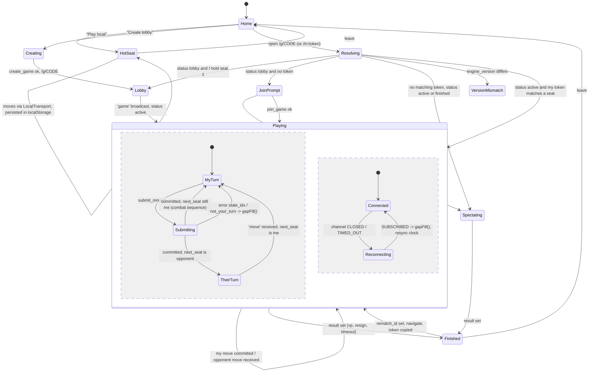

# Mecatol Online, Lobby and Online Architecture

Status: design proposal, 2026-09-03. Scope: two-player, turn-based, deterministic game (TI4 base-game distillation, L1Z1X Mindnet vs Barony of Letnev, 7 hexes). Rules engine is pure TypeScript. Frontend Vite + React + TS on Vercel. Backend Supabase (Postgres, Realtime, Edge Functions, RLS). No user accounts. Same engine for hot-seat and online.

---

## Part 1. How browser board games do lobbies

### 1.1 Product by product

**Board Game Arena (BGA)**
- Unit is the *table*. The creator is the table admin, can "Restrict table access", and gets an invitation link from the open-seat menu before the game starts. Table URLs are numeric: `https://boardgamearena.com/table?table=303742181` (9-digit id, also visible as `/3/spacebase?table=...`). Sources: [forum t=30914](https://forum.boardgamearena.com/viewtopic.php?t=30914), [forum t=31649](https://forum.boardgamearena.com/viewtopic.php?t=31649), [forum t=27559](https://forum.boardgamearena.com/viewtopic.php?t=27559), [BGA FAQ](https://en.boardgamearena.com/faq?anchor=faq_premium_premiumwhysameloc).
- Identity: real accounts. Not a no-account precedent, but the rest of the mechanics are the reference implementation for turn-based play.
- Turn synchronisation and reconnection: the server (PHP game logic plus state machine) is the only authority. On page load or reconnect the client receives the *complete* state (`gamedatas` from the server's `getAllDatas`) and rebuilds the UI in `setup()`; afterwards it receives incremental *notifications*, each stamped with `move_id`, `table_id`, timestamp. Source: [Game interface logic doc](https://en.doc.boardgamearena.com/Game_interface_logic:_yourgamename.js).
- Spectators: same client, `isCurrentPlayerSpectator()` returns true; a CSS class `spectatorMode` hides player-only controls; the same read-only mode is reused for instant replay and archive. Same source.
- Clocks: real-time tables have a per-player reflexion clock. Once an opponent's clock is negative "you can skip their turn as soon as the clock is negative. This player will get a 'leave' penalty and you will win 'by forfeit'". Turn-based tables use a global thinking budget per game speed ("1 move/day"); exceeding it gets you expelled. Sources: [BGA FAQ (doc)](https://en.doc.boardgamearena.com/faq), [Turn-based FAQ](https://en.doc.boardgamearena.com/Turn_based_FAQ).
- Hot-seat vs online: not offered; but turn-based and real-time tables are literally the same code path ("when opponents are simultaneously online, turn-based tables function identically to real-time games"). Source: Turn-based FAQ above.

**Codenames (codenames.game)**
- No accounts, no download. Flow: enter nickname, "Create Room" (`https://codenames.game/room/create`), pick settings, share the room URL (`codenames.game/room/<id>`), friends open it and type a nickname. Voice chat is external. Sources: [codenames.game](https://codenames.game/), [room/create](https://codenames.game/room/create), [Novu handbook writeup](https://handbook.novu.co/happy-hour-thursday/codenames).
- Identity: nickname per room, remembered by the browser. Not documented publicly beyond that; the exact id format of `/room/<id>` is not published either (inference from the URL structure).

**Jackbox (jackbox.tv)**
- Host device (console/PC) runs the game and shows a 4-letter room code; controllers are phones that open `jackbox.tv`, type code plus name. Audience members join with the same code after the players. Sources: [Steam thread "Room Codes are for who?"](https://steamcommunity.com/app/331670/discussions/0/152392786902669021/), [Audience Kit blog](https://www.jackboxgames.com/blog/the-jackbox-audience-kit-twitch-extension-is-now-available).
- Reconnection is cookie based: "cookies will allow you to rejoin the game if you get disconnected", and "do not clear your browser's cache, cookies, and history while a game is running, as you won't be able to rejoin". Rejoin = same room code plus same name from the same browser. Sources: [Jackbox support: trouble connecting my device](https://support.jackboxgames.com/hc/en-us/articles/15794785923223-I-m-having-trouble-connecting-my-device-to-the-game), [Steam PP10 "Can't rejoin after refreshing"](https://steamcommunity.com/app/2216830/discussions/0/3874843400188788684/).
- Architecture lesson: host-authoritative, controllers are thin. Works because the host is a trusted single device. That is exactly the hot-seat case, not the online case.

**skribbl.io**
- "Create private room", then an invite link of the form `https://skribbl.io/?QrPPUafl` (room id in the query string). Friends click, enter nickname and avatar, no account. Owner starts the game. Up to 12 players. Sources: [skribbl wiki: Server](https://skribbl-io.fandom.com/wiki/Server), [skribbl-io.net join guide](https://skribbl-io.net/how-to-join-a-skribbl-io-private-game/), [mytour guide](https://mytour.vn/en/blog/kinh-nghiem-hay/how-to-create-a-private-room-in-skribblio-mytour.html).
- No reconnection to speak of: leaving means leaving; re-entering the link makes you a new player. Fine for a party game, useless for a 30-minute strategy game.

**Colonist.io**
- Custom room with a shareable code/link; joining needs no account. Spectator deep link: `colonist.io/spectate/#xxxx` with the 4-character game id. Sources: [onlineparty.games summary](https://onlineparty.games/games/board-games/colonist-io), [feature request 87960 (spectate by id)](https://colonist.featureupvote.com/suggestions/87960/spectate-games-search-or-jump-to-one-directly), [feature request 89308](https://colonist.featureupvote.com/suggestions/89308/join-as-spectator-when-link-is-clicked-if-game-has-started).
- Disconnect handling: a bot takes over "when a timer goes lower than 10 seconds or after 2 minutes of inactivity"; a returning player can take the seat back from the bot. Known pain: refreshing the tab can land you as a *spectator* instead of in your seat, and reconnecting during a bot turn can freeze the view. Sources: [feature request 198422](https://colonist.featureupvote.com/suggestions/198422/add-a-setting-for-time-until-bot-takes-over-in-case-a-player-disconnects), [feature request 150546](https://colonist.featureupvote.com/suggestions/150546/prevent-reconnecting-as-spectator-instead-of-player), [bug 92808](https://colonist.featureupvote.com/suggestions/92808/bug-with-reconnect-on-a-bots-turn).
- Lesson: seat identity must be a durable token, not "whoever connected last from that browser". Otherwise you get the spectator-instead-of-player bug.

**Dominion Online (Shuffle iT)**
- Accounts required (sign-up, email confirmation to host). Tables: rating restrictions, but "a friend can always join your table, regardless of rating restrictions"; friends-only table = min and max relative rating set to zero. Source: [Dominion Online FAQ](https://forum.shuffleit.nl/index.php?topic=2246.0).
- One session per account: the "kick" on the login screen logs you in here, out everywhere else, and ends the game you were in. Same source.
- Resume from log: "Load Old Game" reloads completed *and* resigned games "with the players in their correct original seats" (2.2.1); league games can be resigned and later reloaded and resumed (2.2.0). Undo needs opponent approval except trivial cases (2.1.0). Adaptive timer replenishes per turn and pauses during pending undo requests (2.2.10). Spectators exist (2.2.9 fix). Source: [dominion.games changelog](https://dominion.games/changelog.html), timeout discussion: [dominionstrategy forum](https://forum.dominionstrategy.com/index.php?topic=14150.0).
- Lesson: the game *is* its move log. Reload, resume and replay all fall out of that.

**boardgame.io (open source)**
- One `Game` object, two transports: `Local()` runs the game master in the browser (pass-and-play), `SocketIO()` talks to a server master. "The framework automatically adapts your single-player game object to multiplayer without code changes." Clients run the game optimistically; the master's state overrides on divergence: "a single source of authority". Source: [multiplayer.md](https://raw.githubusercontent.com/boardgameio/boardgame.io/main/docs/documentation/multiplayer.md) (rendered at [boardgame.io/documentation/#/multiplayer](https://boardgame.io/documentation/#/multiplayer)).
- Seats and spectators: `Client({ game, multiplayer, playerID })`; a client *without* `playerID` is a spectator that "can see the live game state, but can't actually make any moves". Same source.
- Lobby REST: `POST /games/{name}/create` (`numPlayers`, `setupData`, `unlisted`), `POST /games/{name}/{id}/join` returns `playerID` and `playerCredentials` ("the token this player will require to authenticate their actions in the future"), `/leaveSlot`, `/leaveGame`, `/update`, and `/playAgain` which returns a fresh match id for a rematch. Where the credentials are stored is left to the app (in practice localStorage). Source: [api/Lobby.md](https://raw.githubusercontent.com/boardgameio/boardgame.io/main/docs/documentation/api/Lobby.md).
- Randomness: a `seed` on the game object, a `random` API (`D6()`, `Shuffle()`, `Number()`), moves must be pure reducers, and "The RNG and its state must stay on the server" because "all code and data on the client can be viewed and used to a player's advantage". Source: [random.md](https://raw.githubusercontent.com/boardgameio/boardgame.io/main/docs/documentation/random.md).

**Colyseus (open source)**
- Unit is the *Room*: `roomId` is a random 9-character string by default; `maxClients` auto-locks; `autoDispose` when the last client leaves; state sync via `Schema` patches every 50 ms. Source: [docs.colyseus.io/room](https://docs.colyseus.io/room).
- Invite links: `private` rooms are skipped by matchmaking but joinable via `joinById()` if you know the id; `unlisted` hides from listings; `lock()`/`unlock()`. "Share the room ID through external channels... effectively creating invite link functionality." Source: [matchmaker/visibility](https://docs.colyseus.io/matchmaker/visibility).
- Reconnection: server calls `allowReconnection(client, seconds | "manual")` in `onDrop`; a consented `room.leave()` (close code 4000) skips it. Client persists `room.reconnectionToken` ("refreshed on every successful connection", docs suggest `sessionStorage`) and calls `client.reconnect(token)`; succeeds only inside the reconnection window. Source: [room/reconnection](https://docs.colyseus.io/room/reconnection), background: [issue 354 (private reconnection token instead of sessionId)](https://github.com/colyseus/colyseus/issues/354).

**Reference for clocks: lichess**
- Clocks are server side; lichess "compensates for network lag. This includes sustained lag and occasional lag spikes", with limits depending on time control, so "having a higher network lag than your opponent is not a handicap". Source: [lichess.org/lag](https://lichess.org/lag). For a 15-minute clock on 60-odd moves we do not need compensation, but the *server-side* part is the lesson.

### 1.2 Patterns that recur

| Concern | What the field does | Take for Mecatol Online |
| --- | --- | --- |
| Room creation | One click, server assigns a short id (BGA numeric, skribbl 8 chars, Colonist 4, Jackbox 4 letters, Colyseus 9) | 6-char code, no ambiguous glyphs |
| Join code in URL | skribbl `?id`, Colonist `#id`, Codenames `/room/id`, BGA `?table=` | `/g/K7X2QP`, plus `/g/K7X2QP?watch` semantics for spectators (same code) |
| Identity without accounts | Nickname plus browser storage (Codenames, skribbl); cookie (Jackbox); per-seat credential token returned on join (boardgame.io); reconnection token (Colyseus) | Per-seat random token, stored in localStorage, sent with every write |
| Reconnection | Full state resend, then deltas (BGA); token-based seat reclaim inside a window (Colyseus); bot takeover after 2 min (Colonist) | Fold the move log from the DB, then live deltas; seat reclaim by token, no window (turn-based) |
| Turn sync | Server-authoritative log with move ids (BGA notifications carry `move_id`) | Append-only `moves(game_id, idx)`; idx is the sync cursor |
| Spectators | Same client, no seat (boardgame.io no `playerID`, BGA `spectatorMode`) | Same page, no token = spectator |
| Hot-seat vs online | boardgame.io `Local()` vs `SocketIO()` behind one interface | `LocalTransport` vs `SupabaseTransport` behind one interface |
| Dice | Seeded PRNG that lives on the server (boardgame.io) | Per-move seed derived from a server secret, revealed at commit |
| Clocks | Server clock, forfeit on flag (BGA), lag compensation (lichess) | Server timestamps only; any client may claim the flag; server decides |
| Rematch | New match id from old (boardgame.io `playAgain`) | `rematch()` creates the child game, seats reused, both clients navigate |

---

## Part 2. Architecture for Mecatol Online

### 2.1 One-paragraph summary

The game is an append-only move log. Postgres stores it, a SECURITY DEFINER function is the only way to append, and every append gets a per-move RNG seed derived from a secret the clients never see. Both clients (and any spectator) fold the same log through the same pure `reduce()` and arrive at the same state, dice included. Realtime Broadcast (fired from a DB trigger) is the doorbell, the table is the truth. Hot-seat uses the identical store and engine with an in-memory transport. The clock is a pair of server timestamps. Nothing runs on a server except SQL, so v1 costs nothing and has no version skew; the log and seed design make the later switch to an Edge Function that validates moves a transport swap, not a rewrite.

### 2.2 Engine contract (what the rest of the design assumes)

```ts
// packages/engine/src/index.ts (no DOM, no Date, no Math.random)
export type Seat = 1 | 2;

export interface Setup {           // frozen at game creation
  factions: { 1: 'l1z1x' | 'letnev'; 2: 'l1z1x' | 'letnev' };
  colors: { 1: string; 2: string };
  clockMs: number;                 // 900000
  firstSeat: Seat;
  mapVariant: string;
}

export interface GameState {
  nextSeat: Seat;                  // who acts next, always exactly one seat
  round: number; phase: string;
  result?: { winner: Seat | null; reason: 'vp' | 'resign' | 'timeout' | 'abandon' };
  // ... board, units, techs, tokens, objectives
}

export type Move = { type: string; [k: string]: unknown };

export function initialState(setup: Setup): GameState;
export function legalMoves(state: GameState, seat: Seat): Move[];        // UI hints
export function reduce(state: GameState, move: Move, rngSeed: string): GameState; // throws IllegalMove
export function stateHash(state: GameState): string;                    // stable JSON, FNV-1a 64 as hex
```

Rules the engine must respect for determinism:
1. **Exactly one acting seat per state.** Simultaneous decisions (both players choosing whether to retreat, both rolling in combat) are serialized: the engine asks seat A first, then seat B, in a fixed order (initiative order). This keeps `next_seat` a single number, keeps the clock honest (someone is always on the clock), and avoids write races.
2. **One move = one atomic decision.** A combat is a sequence of moves: `combat_roll` (consumes dice), `retreat_decision`, `combat_roll`, ... Each move gets its own `rngSeed`, so a decision taken after seeing dice always uses fresh, unpredictable dice.
3. **Dice come only from the seed.** `reduce` builds `rng = mulberry32(fold32(rngSeed))` (or xoshiro128** from the first 128 bits) and draws `d10 = 1 + floor(rng() * 10)`. Dice consumption order must be deterministic: iterate units sorted by stable id, never by object key order.
4. **No wall clock in the engine.** Clock state lives in the DB and in the transport, not in `GameState`.
5. **`engine_version`** (git short hash or semver) is baked into the bundle and written into the game row. Clients refuse to join a game with another version and show "reload".

### 2.3 Why the seed goes into the move, not into the game

A single game seed known to both clients (the naive approach) lets any client precompute every future roll: "if I attack now, do I win?" is a `for` loop away. boardgame.io states the rule plainly: the RNG state must stay on the server.

The cheap fix that keeps the engine pure and client-side:

- `game_secrets.seed` (32 random bytes) is created by Postgres at game creation and is unreachable through the API (RLS enabled, zero policies, only a SECURITY DEFINER function reads it).
- At commit of move `idx`, the function computes `rng_seed = hex(hmac_sha256(key = seed, msg = game_id || ':' || idx))` and stores it on the move row.
- Every client then applies `reduce(state, move, rng_seed)`. Same input, same output, on both clients and for every spectator, forever (replay is free).
- Before commit, nobody can compute `rng_seed` for the next move. After commit, everybody can. That is the whole trick.

Hot-seat gets the same interface: `LocalTransport` produces `rng_seed` via `crypto.getRandomValues(32 bytes)` per move. The engine does not know the difference.

Consequence for UX: **no optimistic apply.** The acting client submits and waits for the committed row (one round trip, 80 to 250 ms) before rendering the result. Turn-based; nobody notices, and it removes an entire class of rollback bugs.

### 2.4 Who is authoritative: comparison and recommendation

| | A. Client-validated log, DB-gated, Realtime broadcast | B. Edge Function validates every move |
| --- | --- | --- |
| Rules run where | In both browsers (same bundle) | In Deno (same TS package) plus browsers for UI hints |
| What the server enforces | Seat token, turn order (`next_seat`), idx continuity, clock, hidden dice seed, game status | Everything in A plus full legality via `reduce()` |
| Latency per move | One RPC (~100 ms) | Edge Function cold start measured 120 to 800 ms in the wild, ~40 ms warm ([reports](https://www.webversearena.com/blog/supabase-edge-functions-production-guide-2026), [Supabase architecture](https://supabase.com/docs/guides/functions/architecture)) |
| Version skew | None: engine ships only in the frontend bundle | Real: function on v1.3, clients on v1.4 = false rejections until both deploy |
| Cheating surface | A modified client can submit an illegal move; the opponent's client detects it (state hash mismatch) and flags the game | Illegal moves rejected server-side |
| Hidden information | Not possible (all clients see full state) | Possible later via per-seat state views |
| Ops | Zero (SQL only) | One function to deploy, logs to watch |
| Free-tier fit | Yes | Yes (500k invocations/month) |

**Recommendation for v1: A.** Reasons, in order: (1) the players are two friends, and cheating detection (not prevention) is enough; (2) the engine will change weekly during development, and A has no server copy to keep in sync; (3) the one thing that genuinely needs a secret (dice) is solved by the per-move seed inside a 15-line SQL function; (4) latency and feel are better. B is the migration target (section 2.13) and costs a transport swap because the log format is identical.

### 2.5 Identity without accounts: seat tokens

- On "Create lobby" the browser generates `token = base64url(crypto.getRandomValues(32 bytes))` and stores it under `localStorage['md:seat:K7X2QP']`. The DB stores only `sha256(token)`.
- On "Join" the second browser does the same for seat 2.
- Every write RPC takes the raw token and compares the hash. No JWT, no `auth.users` row, no MAU, no per-IP sign-in rate limit.
- Anyone opening `/g/K7X2QP` without a token in storage is a spectator (if both seats are taken) or gets the join prompt (if seat 2 is free). Spectator link = the same URL; there is nothing to leak because the state is public to both players anyway.
- Moving to another device: the page offers "Resume link" = `/g/K7X2QP#t=<token>`. The receiving page stores the token and strips the fragment (`history.replaceState`). Fragment never reaches the server or Vercel logs.
- Lost token (cleared storage, no resume link): opponent can call `release_seat()` so a fresh join re-seats you. Optional for v1.

Option kept in the drawer: Supabase anonymous sign-in (`signInAnonymously()`) gives a real JWT (`is_anonymous: true`, role `authenticated`) so RLS can use `auth.uid()` and Realtime private channels can be authorised on `realtime.messages`. Costs: counts as MAU (irrelevant at 50k free), 30 sign-ins per hour per IP, `auth.users` rows to prune, and the session still dies with cleared storage so you need the seat token anyway. Sources: [anonymous sign-ins](https://supabase.com/docs/guides/auth/auth-anonymous), [MAU discussion](https://github.com/orgs/supabase/discussions/35933), [Realtime authorization](https://supabase.com/docs/guides/realtime/authorization). Use it only if the app ever opens to strangers.

### 2.6 Tables and policies (SQL)

```sql
-- 0. extensions
create extension if not exists pgcrypto;
create extension if not exists pg_cron;

-- 1. types
create type game_status as enum ('lobby', 'active', 'finished', 'abandoned');

-- 2. public game row (no secrets in here, readable by anyone with the code)
create table games (
  id               uuid primary key default gen_random_uuid(),
  code             text not null unique,                 -- K7X2QP
  status           game_status not null default 'lobby',
  engine_version   text not null,
  setup            jsonb not null,                       -- Setup from section 2.2
  p1_name          text, p2_name text,
  first_seat       smallint not null default 1 check (first_seat in (1, 2)),
  move_count       int  not null default 0,
  next_seat        smallint check (next_seat in (1, 2)), -- who may submit move #move_count
  clock_p1_ms      int  not null,
  clock_p2_ms      int  not null,
  clock_owner      smallint check (clock_owner in (1, 2)),
  clock_started_at timestamptz,                          -- server time the running clock started
  result           jsonb,                                -- {winner, reason}
  rematch_of       uuid references games(id),
  rematch_id       uuid references games(id),
  created_at       timestamptz not null default now(),
  updated_at       timestamptz not null default now()
);
create index games_updated_idx on games (updated_at);

-- 3. secrets: seed and seat token hashes. RLS on, zero policies = unreachable via the API.
create table game_secrets (
  game_id       uuid primary key references games(id) on delete cascade,
  seed          bytea not null default gen_random_bytes(32),
  p1_token_hash bytea,
  p2_token_hash bytea
);

-- 4. the log
create table moves (
  game_id    uuid not null references games(id) on delete cascade,
  idx        int  not null,
  seat       smallint not null check (seat in (1, 2)),
  move       jsonb not null,
  rng_seed   text not null,          -- hex(hmac(seed, game_id:idx)), revealed at commit
  next_seat  smallint not null check (next_seat in (1, 2)),
  state_hash text not null,          -- hash of the resulting state as computed by the submitter
  clock_ms   int  not null,          -- submitter's remaining clock after this move (server computed)
  created_at timestamptz not null default now(),
  primary key (game_id, idx)
);

-- 5. RLS
alter table games        enable row level security;
alter table game_secrets enable row level security;
alter table moves        enable row level security;

-- reads: public by code (the code is the capability, the state is public to both players anyway)
create policy games_read on games for select to anon, authenticated using (true);
create policy moves_read on moves for select to anon, authenticated using (true);
-- no insert/update/delete policies anywhere: all writes go through the functions below
revoke insert, update, delete on games, moves, game_secrets from anon, authenticated;
revoke select on game_secrets from anon, authenticated;

-- 6. helpers
create or replace function md_hash(p_token text) returns bytea
language sql immutable as $$ select digest(p_token, 'sha256') $$;

create or replace function md_new_code() returns text
language plpgsql as $$
declare
  alphabet constant text := 'ABCDEFGHJKLMNPQRSTUVWXYZ23456789';  -- 32 symbols, no 0/O/1/I
  c text; b bytea; i int;
begin
  loop
    b := gen_random_bytes(6); c := '';
    for i in 0..5 loop
      c := c || substr(alphabet, 1 + (get_byte(b, i) % 32), 1);
    end loop;
    exit when not exists (select 1 from games where code = c);
  end loop;
  return c;
end $$;

create or replace function md_seat(p_game_id uuid, p_token text) returns smallint
language sql stable security definer set search_path = public as $$
  select case
    when p1_token_hash = md_hash(p_token) then 1
    when p2_token_hash = md_hash(p_token) then 2
  end
  from game_secrets where game_id = p_game_id
$$;

create or replace function server_now() returns timestamptz
language sql stable as $$ select now() $$;

-- 7. lobby
create or replace function create_game(p_token text, p_name text, p_setup jsonb, p_engine_version text)
returns games language plpgsql security definer set search_path = public as $$
declare g games; clock int := coalesce((p_setup->>'clockMs')::int, 900000);
begin
  insert into games (code, engine_version, setup, p1_name, first_seat, clock_p1_ms, clock_p2_ms)
  values (md_new_code(), p_engine_version, p_setup, left(p_name, 24),
          coalesce((p_setup->>'firstSeat')::smallint, 1), clock, clock)
  returning * into g;
  insert into game_secrets (game_id, p1_token_hash) values (g.id, md_hash(p_token));
  return g;
end $$;

create or replace function join_game(p_code text, p_token text, p_name text, p_engine_version text)
returns games language plpgsql security definer set search_path = public as $$
declare g games; s smallint;
begin
  select * into g from games where code = upper(p_code) for update;
  if g.id is null then raise exception 'no_such_game'; end if;
  s := md_seat(g.id, p_token);
  if s is not null then return g; end if;                    -- idempotent rejoin
  if g.status <> 'lobby' then raise exception 'full'; end if;
  if g.engine_version <> p_engine_version then raise exception 'version_mismatch'; end if;
  update game_secrets set p2_token_hash = md_hash(p_token) where game_id = g.id;
  update games set p2_name = left(p_name, 24), status = 'active',
                   next_seat = first_seat, clock_owner = first_seat,
                   clock_started_at = now(), updated_at = now()
  where id = g.id returning * into g;
  return g;
end $$;

-- 8. the only way to append to the log
create or replace function submit_move(
  p_game_id uuid, p_token text, p_idx int, p_move jsonb,
  p_next_seat smallint, p_state_hash text, p_result jsonb default null)
returns moves language plpgsql security definer set search_path = public as $$
declare
  g games; s smallint; m moves; elapsed int; remaining int; seed bytea; rng text;
begin
  select * into g from games where id = p_game_id for update;
  if g.status <> 'active' then raise exception 'not_active'; end if;
  s := md_seat(g.id, p_token);
  if s is null then raise exception 'bad_token'; end if;
  if p_idx <> g.move_count then raise exception 'stale_idx:%', g.move_count; end if;
  if g.next_seat <> s then raise exception 'not_your_turn'; end if;

  -- clock: only the acting seat's clock was running
  elapsed   := (extract(epoch from (now() - g.clock_started_at)) * 1000)::int;
  remaining := (case when s = 1 then g.clock_p1_ms else g.clock_p2_ms end) - elapsed;
  if remaining <= 0 then
    update games set status = 'finished', clock_owner = null,
      result = jsonb_build_object('winner', 3 - s, 'reason', 'timeout'), updated_at = now()
    where id = g.id;
    raise exception 'flag_fell';
  end if;

  -- dice seed: unpredictable before commit, public after
  select gs.seed into seed from game_secrets gs where gs.game_id = g.id;
  rng := encode(hmac(convert_to(g.id::text || ':' || p_idx::text, 'UTF8'), seed, 'sha256'), 'hex');

  insert into moves (game_id, idx, seat, move, rng_seed, next_seat, state_hash, clock_ms)
  values (g.id, p_idx, s, p_move, rng, p_next_seat, p_state_hash, remaining)
  returning * into m;

  update games set
    move_count       = p_idx + 1,
    next_seat        = case when p_result is null then p_next_seat else null end,
    clock_owner      = case when p_result is null then p_next_seat else null end,
    clock_started_at = now(),
    clock_p1_ms      = case when s = 1 then remaining else clock_p1_ms end,
    clock_p2_ms      = case when s = 2 then remaining else clock_p2_ms end,
    status           = case when p_result is null then status else 'finished' end,
    result           = coalesce(p_result, result),
    updated_at       = now()
  where id = g.id;
  return m;
end $$;

-- 9. flag, resign, rematch
create or replace function claim_timeout(p_game_id uuid) returns games
language plpgsql security definer set search_path = public as $$
declare g games; remaining int;
begin
  select * into g from games where id = p_game_id for update;
  if g.status <> 'active' then return g; end if;
  remaining := (case when g.clock_owner = 1 then g.clock_p1_ms else g.clock_p2_ms end)
             - (extract(epoch from (now() - g.clock_started_at)) * 1000)::int;
  if remaining > 0 then raise exception 'not_yet:%', remaining; end if;
  update games set status = 'finished', next_seat = null, clock_owner = null,
    result = jsonb_build_object('winner', 3 - g.clock_owner, 'reason', 'timeout'), updated_at = now()
  where id = g.id returning * into g;
  return g;
end $$;

create or replace function resign(p_game_id uuid, p_token text) returns games
language plpgsql security definer set search_path = public as $$
declare g games; s smallint;
begin
  select * into g from games where id = p_game_id for update;
  s := md_seat(g.id, p_token);
  if s is null then raise exception 'bad_token'; end if;
  if g.status not in ('active', 'lobby') then return g; end if;
  update games set status = case when g.status = 'lobby' then 'abandoned' else 'finished' end,
    next_seat = null, clock_owner = null,
    result = jsonb_build_object('winner', 3 - s, 'reason', 'resign'), updated_at = now()
  where id = g.id returning * into g;
  return g;
end $$;

create or replace function rematch(p_game_id uuid, p_token text) returns games
language plpgsql security definer set search_path = public as $$
declare g games; n games; s smallint; sec game_secrets; new_setup jsonb;
begin
  select * into g from games where id = p_game_id for update;
  s := md_seat(g.id, p_token);
  if s is null then raise exception 'bad_token'; end if;
  if g.status <> 'finished' then raise exception 'not_finished'; end if;
  if g.rematch_id is not null then
    select * into n from games where id = g.rematch_id; return n;   -- idempotent, both may press
  end if;
  select * into sec from game_secrets where game_id = g.id;
  -- swap factions and colours, alternate first seat
  new_setup := g.setup
    || jsonb_build_object('factions', jsonb_build_object('1', g.setup->'factions'->'2', '2', g.setup->'factions'->'1'))
    || jsonb_build_object('colors',   jsonb_build_object('1', g.setup->'colors'->'2',   '2', g.setup->'colors'->'1'))
    || jsonb_build_object('firstSeat', 3 - g.first_seat);
  insert into games (code, engine_version, setup, p1_name, p2_name, first_seat, status,
                     next_seat, clock_owner, clock_started_at, clock_p1_ms, clock_p2_ms, rematch_of)
  values (md_new_code(), g.engine_version, new_setup, g.p1_name, g.p2_name, 3 - g.first_seat, 'active',
          3 - g.first_seat, 3 - g.first_seat, now(),
          (g.setup->>'clockMs')::int, (g.setup->>'clockMs')::int, g.id)
  returning * into n;
  insert into game_secrets (game_id, p1_token_hash, p2_token_hash)
  values (n.id, sec.p1_token_hash, sec.p2_token_hash);        -- same tokens, seats keep their numbers
  update games set rematch_id = n.id, updated_at = now() where id = g.id;
  return n;
end $$;

-- 10. grants: functions only
revoke execute on all functions in schema public from public;
grant execute on function server_now(), create_game(text, text, jsonb, text), join_game(text, text, text, text),
  submit_move(uuid, text, int, jsonb, smallint, text, jsonb), claim_timeout(uuid),
  resign(uuid, text), rematch(uuid, text) to anon, authenticated;
-- md_hash, md_seat, md_new_code stay internal (no grant)

-- 11. Realtime: broadcast from the database, public topic per game
create or replace function md_broadcast_move() returns trigger
language plpgsql security definer set search_path = public as $$
begin
  perform realtime.send(
    jsonb_build_object('idx', new.idx, 'seat', new.seat, 'move', new.move, 'rng_seed', new.rng_seed,
                       'next_seat', new.next_seat, 'state_hash', new.state_hash,
                       'clock_ms', new.clock_ms, 'committed_at', new.created_at),
    'move', 'game:' || new.game_id::text, false);
  return new;
end $$;
create trigger moves_broadcast after insert on moves
  for each row execute function md_broadcast_move();

create or replace function md_broadcast_game() returns trigger
language plpgsql security definer set search_path = public as $$
begin
  perform realtime.send(
    jsonb_build_object('status', new.status, 'p1_name', new.p1_name, 'p2_name', new.p2_name,
                       'move_count', new.move_count, 'next_seat', new.next_seat,
                       'clock_p1_ms', new.clock_p1_ms, 'clock_p2_ms', new.clock_p2_ms,
                       'clock_owner', new.clock_owner, 'clock_started_at', new.clock_started_at,
                       'result', new.result, 'rematch_id', new.rematch_id, 'updated_at', new.updated_at),
    'game', 'game:' || new.id::text, false);
  return new;
end $$;
create trigger games_broadcast after update on games
  for each row execute function md_broadcast_game();

-- 12. cleanup (UTC, nightly)
select cron.schedule('md-cleanup', '15 3 * * *', $$
  delete from games where status = 'lobby'     and created_at < now() - interval '24 hours';
  update games set status = 'abandoned', next_seat = null, clock_owner = null, updated_at = now()
    where status = 'active' and updated_at < now() - interval '7 days';
  delete from games where status in ('finished', 'abandoned') and updated_at < now() - interval '60 days';
$$);
```

Notes on the SQL:
- `realtime.send(payload, event, topic, private)`; the last argument `false` = public topic, anyone can subscribe. The DB is the only sender of `move` and `game` events; clients treat broadcasts as a doorbell and re-fetch on any doubt (section 2.7), so a stranger spamming the public topic can at most trigger a harmless extra `select`. Source: [Realtime Broadcast](https://supabase.com/docs/guides/realtime/broadcast). Keep "Allow public access" on in the Realtime settings for v1; flip to private channels only together with anonymous auth.
- `games_read using (true)` means someone could `select * from games` and list codes. At hobby scale with a friends-only app this is acceptable; the tight variant is a `get_game(code)` RPC plus dropping the policy, ten lines, no client change beyond one call.
- `moves` are cascade-deleted with the game; `game_secrets` too.
- Storage per game: ~60 moves at ~0.4 KB = ~25 KB; 500 MB free = ~15,000 archived games.

### 2.7 Message flow

```mermaid
sequenceDiagram
  participant H as Host browser
  participant DB as Supabase Postgres (RPC)
  participant RT as Supabase Realtime
  participant G as Guest browser
  participant S as Spectator

  H->>DB: create_game(token1, name, setup, engine_version)
  DB-->>H: game row {code: K7X2QP, status: lobby}
  Note over H: localStorage['md:seat:K7X2QP'] = token1, navigate /g/K7X2QP
  H->>RT: subscribe game:<id>, presence.track({seat:1})

  G->>DB: select games where code = K7X2QP (anon)
  G->>DB: join_game(K7X2QP, token2, name, engine_version)
  DB-->>G: game {status: active, next_seat: 1, clock_started_at}
  DB->>RT: trigger: broadcast 'game'
  RT-->>H: 'game' (status active) -> H fetches moves (none), starts clock display
  G->>RT: subscribe, presence.track({seat:2})

  H->>DB: submit_move(id, token1, idx 0, move, next_seat 2, state_hash)
  DB->>DB: check token, idx, turn, clock; rng_seed = hmac(seed, id:0); insert; update games
  DB-->>H: committed move (rng_seed, clock_ms)
  DB->>RT: trigger: broadcast 'move' idx 0
  RT-->>G: 'move' idx 0 -> reduce(state, move, rng_seed), compare state_hash
  RT-->>S: same
  Note over H,G: both display: next_seat 2, clock 2 running from committed_at

  G-->>RT: (network drop) ... reconnect
  RT-->>G: SUBSCRIBED again -> G selects moves where idx >= local.length (gap fill)

  G->>DB: claim_timeout(id) when displayed clock of seat 1 hits 0
  DB-->>G: finished by timeout, or 'not_yet:1234'
  H->>DB: rematch(id, token1)  -> new game, same token hashes
  DB->>RT: 'game' with rematch_id -> both navigate to /g/<newcode>, copy token in localStorage
```

Client-side receive rule (the same for players and spectators):

```
on 'move' payload p:
  if p.idx <  log.length: ignore (duplicate)
  if p.idx == log.length: append, state = reduce(state, p.move, p.rng_seed); if hash(state) != p.state_hash: flag desync
  if p.idx >  log.length: gapFill()  // select * from moves where game_id = ? and idx >= log.length order by idx
on 'game' payload: merge clock fields, status, result, rematch_id
on SUBSCRIBED (initial or after reconnect): gapFill(); resync server time offset
```

Server time: on connect call `server_now()`, measure RTT, `offset = serverNow + RTT/2 - Date.now()`. Displayed remaining for the clock owner = `clock_ms - (Date.now() + offset - clock_started_at)`. Refresh the offset after every reconnect.

### 2.8 Client state machine



React store shape (one store for both modes):

```ts
interface Store {
  mode: 'local' | 'online';
  setup: Setup;
  log: CommittedMove[];            // {idx, seat, move, rngSeed, nextSeat, stateHash, clockMs, committedAt}
  state: GameState;                // fold(log)
  mySeat: Seat | null;             // null = spectator
  clock: { p1Ms: number; p2Ms: number; owner: Seat | null; startedAt: number | null; offsetMs: number };
  conn: 'connected' | 'reconnecting' | 'offline';
  desync: boolean;
}

interface Transport {
  load(): Promise<{ game: GameRow; moves: CommittedMove[] }>;
  submit(idx: number, move: Move, nextSeat: Seat, stateHash: string, result?: Result): Promise<CommittedMove>;
  onMove(cb: (m: CommittedMove) => void): () => void;
  onGame(cb: (g: Partial<GameRow>) => void): () => void;
  claimTimeout(): Promise<void>;
  resign(): Promise<void>;
  rematch(): Promise<GameRow>;
}
// LocalTransport: in-memory log, rngSeed from crypto.getRandomValues, clock from performance.now(),
//                 persisted to localStorage['md:local:<uuid>'] after every move (refresh-safe hot-seat)
// SupabaseTransport: RPCs above plus channel `game:<id>` (broadcast 'move'/'game', presence)
```

Hot-seat specifics: the same screen, `mySeat` flips to `state.nextSeat` after every commit, with a "pass the device" interstitial that hides the board (matters once hidden info exists; today it is a courtesy). Undo: before commit the UI composes a multi-step action locally, so "Undo" is free; after commit, online undo needs opponent approval (Dominion pattern) and is out of v1. Hot-seat may allow post-commit undo by truncating the local log (no dice move may be undone, to keep the "dice are final" rule identical in both modes).

### 2.9 Reconnect and resume

- Page load on `/g/CODE`: read token from `localStorage['md:seat:CODE']` (or `#t=` fragment), `select games by code`, `select moves order by idx`, fold, subscribe, presence-track. Cost: one round trip plus a ~25 KB log worst case. Fast enough that no state snapshot is needed in v1; add `games.state_snapshot jsonb` (written by the client every N moves or by the Edge Function in v2) if games ever get long.
- The Supabase JS client reconnects the websocket by itself; the `subscribe()` callback fires `SUBSCRIBED` again and the store runs `gapFill()`, which closes any window in which broadcasts were missed. The log index makes this trivially idempotent.
- Presence (`presence.track({ seat, name })`) drives the "opponent disconnected" badge. The clock does not stop (chess rules; BGA does the same). If the disconnected player's 15 minutes run out, the opponent's client calls `claim_timeout()`.
- Both tabs open on the same device: both hold the same token, both may act; the DB serialises through `idx`, the loser gets `stale_idx` and gap-fills. Harmless.
- Resume on another device: the resume link with the token in the fragment (section 2.5).

### 2.10 Rematch

`rematch()` is idempotent (both may press; second call returns the existing child). The child game reuses the seat token hashes so no join step is needed, swaps factions and colours, alternates the first seat, starts `active` with the clock running for the new first seat, and links both ways (`rematch_of`, `rematch_id`). The `game` broadcast carries `rematch_id`; each client copies `localStorage['md:seat:OLD']` to `['md:seat:NEW']` and navigates. Spectators follow the same broadcast. This is boardgame.io's `playAgain` with the seats baked in.

### 2.11 Clocks (15 minutes per player, honest across clients)

- Truth lives in three columns: `clock_p1_ms`, `clock_p2_ms` (remaining at the last commit) and `clock_owner` + `clock_started_at` (server `now()` at the last commit). The DB, not the client, computes elapsed time inside `submit_move` and `claim_timeout`.
- Clients only *display*: `remaining = clock_x_ms - (serverNowEstimate - clock_started_at)`. A tampered client can show itself whatever it wants; it cannot change what the DB deducts.
- Flag fall: whoever notices (opponent, spectator, or even the flagged player's own client) calls `claim_timeout()`; the function re-checks with server time and either finishes the game or answers `not_yet:<ms>`. No cron, no server loop.
- Lag: the acting player pays their own request latency (typically 50 to 250 ms per move, ~10 s over a whole game). No compensation in v1; if it grates, add a Fischer increment (`+2 s` per move, one line in `submit_move`) which is simpler and fairer than lichess-style compensation for a 15-minute turn-based game. Source for the compensation model, should it ever be needed: [lichess.org/lag](https://lichess.org/lag).
- Pause: none. Both players agreeing to pause would be a `pause`/`resume` pair of RPCs that null and re-set `clock_started_at`; leave it out until asked.

### 2.12 Lobby lifecycle, cleanup, hosting

Lifecycle of a `games` row: `lobby` (created, seat 2 free) -> `active` (joined) -> `finished` (vp, resign, timeout) or `abandoned` (lobby resigned by host, or no move for 7 days). Cleanup by `pg_cron` nightly: unjoined lobbies after 24 h, `active` with no move for 7 days -> `abandoned`, `finished`/`abandoned` deleted after 60 days (bump if replays matter). pg_cron is available on the free plan. Source: [Supabase pg_cron](https://supabase.com/docs/guides/database/extensions/pg_cron).

Vercel: static Vite build; `vercel.json` rewrite `{"rewrites":[{"source":"/(.*)","destination":"/index.html"}]}` so `/g/K7X2QP` serves the SPA. Env: `VITE_SUPABASE_URL`, `VITE_SUPABASE_ANON_KEY` (publishable key). Route `/g/:code` reads the code, uppercases it, validates against `^[A-Z2-9]{6}$`.

Supabase project settings: Realtime "Allow public access" on; `moves`/`games` do *not* need to be in the `supabase_realtime` publication because broadcasts come from triggers, not from `postgres_changes` (fewer messages, and you control the payload).

Free-plan gotcha: free projects pause after one week without activity, which would make every link dead until you unpause. Either accept it, keep a weekly keep-alive (a GitHub Actions cron calling `server_now()`), or pay Pro. Source: [Supabase pricing](https://supabase.com/pricing).

### 2.13 Cost at hobby scale

| Resource | Free plan | Consumption per game (2 players, 1 spectator, ~60 moves) | Headroom |
| --- | --- | --- | --- |
| Realtime messages | 2,000,000 / month | ~60 moves x 3 subscribers + ~10 game events x 3 + presence ~20 = ~230 | ~8,000 games / month |
| Realtime peak concurrent connections | 200 | 3 | ~65 simultaneous games with spectators |
| DB size | 500 MB | ~25 KB | ~15,000 archived games (with 60-day cleanup, never an issue) |
| Edge Function invocations | 500,000 / month | 0 in v1, ~60 in v2 | ~8,000 games / month in v2 |
| Vercel Hobby | 100 GB bandwidth | ~1 MB first load, cached | thousands of players |

Pro at $25/month buys 500 connections, 5M messages, 8 GB, no pausing. Numbers: [Supabase pricing](https://supabase.com/pricing). Realistic monthly cost for two friends and a few onlookers: EUR 0, or EUR 25 if you refuse the pause.

### 2.14 Migration path to server-authoritative (v2)

Nothing about the log changes. Steps:
1. The engine already lives in `packages/engine` with zero DOM or Node imports. Add a Deno import map entry or bundle it into the function with `esbuild`.
2. Edge Function `submit-move`: takes the same arguments as the RPC, loads `games` + `moves` (or `state_snapshot` + tail), runs `reduce()` for real (throws on illegal), computes `next_seat`, `state_hash`, `result` itself, then calls `submit_move()` with the service-role key. Add `p_caller text` or simply `revoke execute on function submit_move from anon, authenticated` so only the function can append.
3. Client: `SupabaseTransport.submit()` posts to the function URL instead of `rpc('submit_move')`. Keep the client-side `reduce()` for legality hints and instant UI; the server's answer is final.
4. Version skew becomes real: the function reads `games.engine_version` and refuses moves from clients on another version; deploy function and frontend together (one CI job).
5. Hidden information, if the ruleset ever gets any: add `stateView(state, seat)` to the engine, broadcast per-seat views on *private* channels (`private := true` plus anonymous sign-in and RLS on `realtime.messages`), and stop shipping `rng_seed` before it is needed. Source: [Realtime authorization](https://supabase.com/docs/guides/realtime/authorization).
6. Optional: write `state_snapshot` every N moves from the function so long games rehydrate in one read.

Effort estimate: one or two evenings, because the schema, the seed derivation and the transport interface were designed for it now.

### 2.15 Three alternatives, one line each

- **PeerJS / WebRTC only.** Zero backend and instant moves, but you still need signalling (PeerJS cloud is free and best-effort), no TURN means some home networks never connect, the game dies when both tabs close (no persistence, no resume, no spectators without a mesh), and the host tab becomes the authority, which is the Jackbox model and fine only when the host is trusted hardware.
- **Cloudflare Durable Objects.** The textbook "one object per room with WebSockets and SQLite" fit, free plan 100k requests/day and 5 GB ([DO pricing](https://developers.cloudflare.com/durable-objects/platform/pricing/)), but it is a second platform next to Supabase, the engine would have to run inside the object from day one (server-authoritative now, more work now), and it buys scale you do not need before v3.
- **boardgame.io with its server.** Gives Lobby REST, `playerCredentials`, `Local()` vs `SocketIO()`, spectators and `playAgain` out of the box, but demands a long-running Node process (not Vercel, so Fly/Railway at ~EUR 5/month), forces your engine into its `G`/`ctx` reducer model, and you should check maintenance activity before betting on it (last major line 0.50, 2022).

---

## Sources

- Board Game Arena: https://forum.boardgamearena.com/viewtopic.php?t=30914 , https://forum.boardgamearena.com/viewtopic.php?t=31649 , https://forum.boardgamearena.com/viewtopic.php?t=27559 , https://en.doc.boardgamearena.com/Game_interface_logic:_yourgamename.js , https://en.doc.boardgamearena.com/Turn_based_FAQ , https://en.doc.boardgamearena.com/faq , https://en.boardgamearena.com/faq?anchor=faq_premium_premiumwhysameloc
- Codenames: https://codenames.game/ , https://codenames.game/room/create , https://handbook.novu.co/happy-hour-thursday/codenames
- Jackbox: https://support.jackboxgames.com/hc/en-us/articles/15794785923223-I-m-having-trouble-connecting-my-device-to-the-game , https://steamcommunity.com/app/2216830/discussions/0/3874843400188788684/ , https://steamcommunity.com/app/331670/discussions/0/152392786902669021/ , https://www.jackboxgames.com/blog/the-jackbox-audience-kit-twitch-extension-is-now-available
- skribbl.io: https://skribbl-io.fandom.com/wiki/Server , https://skribbl-io.net/how-to-join-a-skribbl-io-private-game/ , https://mytour.vn/en/blog/kinh-nghiem-hay/how-to-create-a-private-room-in-skribblio-mytour.html
- Colonist.io: https://onlineparty.games/games/board-games/colonist-io , https://colonist.featureupvote.com/suggestions/87960/spectate-games-search-or-jump-to-one-directly , https://colonist.featureupvote.com/suggestions/89308/join-as-spectator-when-link-is-clicked-if-game-has-started , https://colonist.featureupvote.com/suggestions/198422/add-a-setting-for-time-until-bot-takes-over-in-case-a-player-disconnects , https://colonist.featureupvote.com/suggestions/150546/prevent-reconnecting-as-spectator-instead-of-player , https://colonist.featureupvote.com/suggestions/92808/bug-with-reconnect-on-a-bots-turn
- Dominion Online: https://forum.shuffleit.nl/index.php?topic=2246.0 , https://dominion.games/changelog.html , https://forum.dominionstrategy.com/index.php?topic=14150.0
- boardgame.io: https://raw.githubusercontent.com/boardgameio/boardgame.io/main/docs/documentation/multiplayer.md , https://raw.githubusercontent.com/boardgameio/boardgame.io/main/docs/documentation/api/Lobby.md , https://raw.githubusercontent.com/boardgameio/boardgame.io/main/docs/documentation/random.md
- Colyseus: https://docs.colyseus.io/room , https://docs.colyseus.io/room/reconnection , https://docs.colyseus.io/matchmaker/visibility , https://github.com/colyseus/colyseus/issues/354
- lichess: https://lichess.org/lag
- Supabase: https://supabase.com/docs/guides/realtime/broadcast , https://supabase.com/docs/guides/realtime/authorization , https://supabase.com/docs/guides/auth/auth-anonymous , https://github.com/orgs/supabase/discussions/35933 , https://supabase.com/docs/guides/database/extensions/pg_cron , https://supabase.com/pricing , https://supabase.com/docs/guides/functions/architecture , https://www.webversearena.com/blog/supabase-edge-functions-production-guide-2026
- Cloudflare: https://developers.cloudflare.com/durable-objects/platform/pricing/
